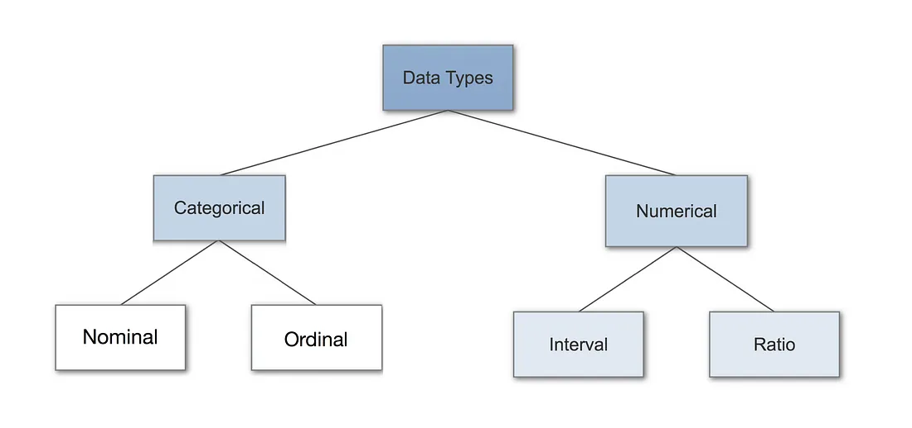

Dados categóricos representam características como gênero ou idioma. Podem ter valores numéricos (1 para feminino e 0 para masculino, mas sem significado matemático).

Dados nominais são utilizados para etiquetar variáveis sem valor quantitativo. A ordem dos valores não altera seu significado. Por exemplo, "casado" e "não casado" são valores dicotômicos (apenas duas categorias), enquanto idiomas falados não têm ordem específica.

Dados ordinais são semelhantes aos nominais, mas com uma ordem específica. Por exemplo, o nível educacional pode ser primário, médio, graduação e pós-graduação. A principal limitação é que a diferença entre os níveis não é uniforme ou conhecida. Esses dados são usados frequentemente para medir características não numéricas, como satisfação ou felicidade.

Dados numéricos são divididos em discretos e contínuos:

Dados Discretos: Valores distintos e contáveis, como o número de caras em lançamentos de moeda. Não podem ser medidos, apenas contados.

Dados Contínuos: Representam medições, como altura. Podem ser medidos, mas não contados, utilizando intervalos na linha dos números reais.

Dados de intervalo são numéricos e ordenados com diferenças iguais entre os valores, como a temperatura. Esses dados não possuem um zero verdadeiro, o que significa que não se pode calcular proporções ou multiplicar/dividir. Somente operações de soma e subtração são válidas.

Dados de razão são numéricos e ordenados, com diferenças iguais entre valores e um zero absoluto, permitindo todas as operações matemáticas (soma, subtração, multiplicação e divisão). Exemplos incluem altura, peso e comprimento.

Dados categóricos são rótulos; ordinais têm ordem; discretos são contáveis; contínuos são medíveis; intervalos têm diferença igual; razões têm zero absoluto.

-------------------------------------------

# PCA

A Análise de Componentes Principais (PCA - Principal Component Analysis) é uma técnica estatística usada para simplificar um conjunto de dados com muitas variáveis inter-relacionadas, transformando-as em um novo conjunto de variáveis ortogonais, chamadas de componentes principais. Essas novas variáveis são ordenadas de forma que o primeiro componente principal retém a maior parte possível da variância presente nos dados originais, o segundo componente retém a maior parte da variância restante, e assim por diante. PCA é uma ferramenta poderosa para análise de dados, ajudando a tornar grandes conjuntos de dados mais gerenciáveis e interpretáveis.

---------------------------------------------------------

### Resumo

- **MCAR:** A ausência de dados é totalmente aleatória e não relacionada a nenhuma variável.
- **MAR:** A ausência de dados está relacionada a outras variáveis no conjunto de dados, mas não à variável que está ausente.
- **MNAR:** A ausência de dados está relacionada ao próprio valor ausente ou a um motivo não observado.

`dropna`: Remove observações ou variáveis com dados ausentes; simples, mas pode resultar na perda de muitos dados.

Random Sample Imputation: Substitui valores ausentes por observações completas selecionadas aleatoriamente; mantém variabilidade, mas pode introduzir variabilidade indesejada.

Mean Imputation: Substitui valores ausentes pela média da variável; fácil, mas reduz variabilidade e pode introduzir vieses.

Multiple imputation é uma técnica poderosa para lidar com dados ausentes que envolve criar múltiplas estimativas para os valores ausentes, realizar análises separadas em cada conjunto de dados imputado e combinar os resultados para obter estimativas finais que levam em conta a incerteza. É amplamente utilizado em pesquisas estatísticas e análises de dados onde a precisão e a validade são cruciais.

Mean, Median, Mode, or Any Other Imputation Method:

Média: Substituir valores ausentes pela média dos valores observados.
Mediana: Substituir valores ausentes pela mediana dos valores observados.
Moda: Substituir valores ausentes pela moda dos valores observados.
Qualquer Outro Método: Pode incluir imputação por amostra aleatória, hot-deck, etc.

Multiple Imputation, Regression Imputation:

Imputação Múltipla: Criar várias versões dos dados com diferentes valores imputados e combinar os resultados das análises realizadas em cada conjunto.
Imputação por Regressão: Usar modelos de regressão para prever e imputar os valores ausentes com base em outras variáveis.

Pattern Substitution, Maximum Likelihood Estimation:

Substituição de Padrões: Usar padrões observados nos dados para substituir os valores ausentes.
Estimação de Máxima Verossimilhança: Usar métodos estatísticos para estimar os valores mais prováveis para os dados ausentes com base na distribuição dos dados observados.

| Type of missing data             | Imputation method                                         |
|----------------------------------|-----------------------------------------------------------|
| Missing Completely At Random     | Mean, Median, Mode, or any other imputation method        |
| Missing At Random                | Multiple imputation, Regression imputation                |
| Missing Not At Random            | Pattern Substitution, Maximum Likelihood estimation       |

MCAR: Ausência completamente aleatória, não relacionada a nenhuma variável. Pode ser tratado de forma simples.
MAR: Ausência relacionada a outras variáveis, mas não à própria variável ausente. Pode ser tratado com técnicas que utilizam outras informações do conjunto de dados.
MNAR: Ausência relacionada ao próprio valor ausente ou a fatores não observados. É mais difícil de tratar e requer técnicas mais avançadas.

----------------------------------------------------

One-Hot Encoding
Função: Converte dados categóricos em uma matriz binária, onde cada categoria é representada por uma coluna com valores 0 ou 1.

Exemplo:

Descrição: Você tem uma coluna animal com valores como ['cachorro', 'gato', 'pássaro'].
Uso: One-Hot Encoding criará três colunas: animal_cachorro, animal_gato e animal_pássaro. Cada linha terá 1 na coluna correspondente ao animal e 0 nas outras.

Ordinal Encoding
Função: Atribui valores numéricos a dados categóricos que possuem uma ordem específica.

Exemplo:
Descrição: Você tem uma coluna qualidade com valores como ['ruim', 'médio', 'bom', 'excelente'].
Uso: Ordinal Encoding atribuirá números baseados na ordem. Por exemplo: ruim=1, médio=2, bom=3, excelente=4.

Label Encoding
Função: Converte dados categóricos em valores numéricos inteiros únicos. Ideal para variáveis-alvo.

Exemplo:

Descrição: Você tem uma coluna classe com valores como ['A', 'B', 'C'].
Uso: Label Encoding atribuirá um número único para cada categoria. Por exemplo: A=0, B=1, C=2.

---------------------------------------------

Padronização: Transforma dados para ter média 0 e desvio padrão 1. Útil para algoritmos que assumem distribuição normal.

Normalização: Escala dados para intervalo específico (0,1) ou (-1,1). Útil para dados com diferentes escalas.

Métodos de Normalização:

Min-Max: Transforma dados para [0,1] ou [-1,1].
Mean: Normaliza para média 0 e desvio padrão 1.
Max-Abs: Escala para [-1,1] dividindo pelo valor absoluto máximo.
Robust: Usa IQR, resistente a outliers.