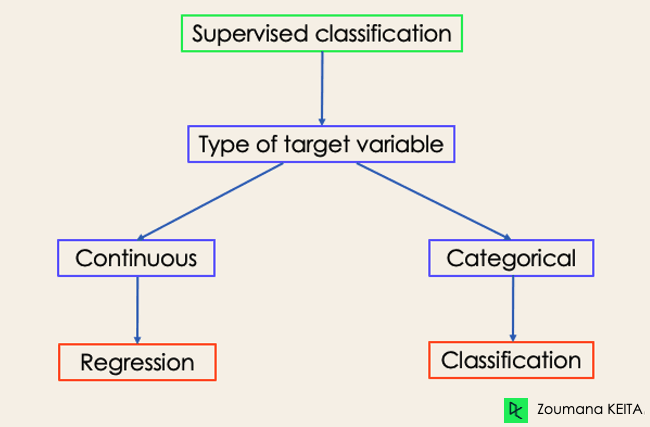

Aprendizes ávidos (Eager learners):

- Constroem um modelo a partir dos dados de treinamento antes de fazer previsões.
- Gastam mais tempo no processo de treinamento para melhor generalização.
- Requerem menos tempo para fazer previsões.

Exemplos: Regressão Logística, Máquina de Vetores de Suporte, Árvores de Decisão, Redes Neurais Artificiais.

Aprendizes preguiçosos (Lazy learners):

- Não criam um modelo imediatamente a partir dos dados de treinamento.
- Memorizam os dados de treinamento.
- Para cada previsão, buscam o vizinho mais próximo em todos os dados de treinamento.
- São mais lentos durante a previsão.

Exemplos: K-Vizinhos Mais Próximos, Raciocínio baseado em casos.

BallTrees e KDTrees melhoram latência de previsão em preguiçosos.

Machine Learning tem 4 categorias: supervisionado, não supervisionado, semi-supervisionado e aprendizado por reforço. Classificação e regressão são supervisionados, mas diferentes:
- Classificação: prevê variáveis discretas (ex: sentimento de um texto)
- Regressão: prevê variáveis contínuas (ex: salário baseado em educação, experiência)

Saúde: ML classifica diagnósticos, prevê doenças como COVID-19 e futuras epidemias. Análise de dados históricos ajuda especialistas em decisões.

Educação: ML analisa textos, vídeos e áudios. Classifica documentos, identifica idiomas e analisa feedback de alunos sobre professores.

Transporte: ML prevê aumento de tráfego e problemas devido ao clima. Essencial para desenvolvimento econômico, usa aprendizado profundo.

Agricultura: ML promove sustentabilidade, prevendo terras adequadas para sementes e condições climáticas. Ajuda fazendeiros sem danos ambientais.

Há quatro tipos principais de tarefas de classificação em Machine Learning:

Classificação Binária: Classifica dados em duas categorias mutuamente exclusivas. Rótulos são binários (ex: verdadeiro/falso, positivo/negativo, 0/1, spam/não spam). Exemplo: identificar se uma imagem é de um caminhão ou de um barco.

Classificação Multiclasse: Envolve três ou mais categorias mutuamente exclusivas. O objetivo é prever a qual classe uma entrada pertence. Diferentemente da classificação binária, há mais opções de rótulos. Exemplo: um modelo que classifica corretamente uma imagem como sendo de um avião entre várias opções.

------------------------------------------

Accuracy  = (True Positives + True Negatives)/(True Positives + True Negatives + False Positives + False Negatives)
(how many u got right)

Precision = TP / (TP + FP)
(grau de variação das medições)

Recall = TP / (TP + FN)

All positives out of the positives labels

F1 = 2 (TP) / 2 (TP + FP + FN) (how good and complete are the predictions)

--------------------------------------------------

Decision n' Classifcation Trees

# Colocar no topo do node o dado mais relevante, logo calcule a impureza

# Ver a impureza das folhas da arvore = 1 - (yes/total)2 - (no/total)2, peso = qtd folha/total nas folhas

---------------------------------------------------

Naive Bayes

Assume independência entre as características (daí o "ingênuo"). É simples, rápido e eficaz, especialmente para classificação de texto e análise de sentimentos. Funciona bem com conjuntos de dados pequenos.

# Probabilities and Likelihoods

# Not Spam

Dear 0.47
Money 0.06
Lunch 0.19

# Spam

Dear 0.29
Money 0.57
Lunch 0 (n pdoe ser zero adiciona uma palavra pra não zerar na multiplicação kk)

-------------------------------------------------

Support Vector Machines (SVM)

# Soft margin (:))

# SVM coloca de RN pra RN+x COM BASE NO KERNEL NECEESSIDTÁRIOP

----------------------------------------------------

# Cross Validation

Vai testando por probabilidades 
Quatro blocos e ai faz só o primeiro sobre o outros 3, segundo sbore 1 3 4 etc etc

-----------------------------------------------------

Random Forests

faz várias arvores aleatórias e faz a média 

Resumo dos pontos principais sobre Ensemble Learning (5-10 minutos de leitura):

1. Definição: Ensemble Learning combina múltiplos modelos simples (weak learners) para criar um modelo mais robusto (strong learner).

2. Objetivo: Reduzir bias e variância, tornando o modelo final mais consistente e menos suscetível a ruídos.

3. Principais métodos:
   - Bagging: Modelos homogêneos treinados independentemente e em paralelo.
   - Boosting: Modelos homogêneos treinados sequencialmente, cada um aprendendo com os erros do anterior.
   - Stacking: Modelos heterogêneos treinados em paralelo, com um meta-modelo final.

4. Bagging:
   - Usa bootstrapping (amostragem com reposição) para criar subconjuntos de dados.
   - Treina modelos independentes em cada subconjunto.
   - Combina resultados por média ou votação.
   - Exemplo: Random Forest.

5. Boosting:
   - Foco em reduzir bias.
   - Treina modelos sequencialmente, priorizando observações mal classificadas anteriormente.
   - Tipos principais: AdaBoost e Gradient Boosting.

6. AdaBoost:
   - Atribui pesos às observações, aumentando para as mal classificadas.
   - Modelos com melhor desempenho têm maior influência na decisão final.

7. Gradient Boosting:
   - Treina novos modelos para prever os erros dos modelos anteriores.
   - Soma as previsões de todos os modelos para obter o resultado final.

8. Stacking:
   - Usa previsões de modelos base como features para um modelo final.
   - Pode combinar modelos heterogêneos.

9. Aplicação prática:
   - Exemplo usando Gradient Boosting e Random Forest em um dataset de preços de casas em Boston.

10. Conclusão:
    - Métodos de Ensemble Learning são flexíveis e adaptáveis.
    - XGBoost é mencionado como um modelo mais avançado.
    - Importância de entender o problema e ser criativo na aplicação desses métodos.

